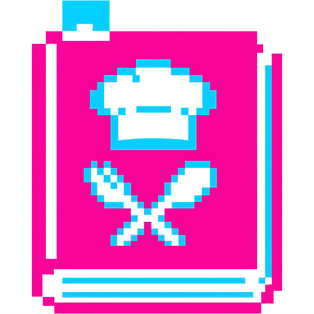

<div align="center">
   
   <h1>Cook Book</h1>
   <p><b><i>Руководство по работе над проектом ＼（〇_ｏ）／</i></b></p>
   <p align="center">
      <a href="https://git-scm.com/"></a>
      <a href="https://github.com/"></a>
      <a href="https://www.conventionalcommits.org/"></a>
   </p>
</div>

---

## 1. Общие сведения

Проект использует Git с веточной моделью Git Flow (упрощенная версия) для организации разработки. Все изменения в основной ветке `main` должны попадать через Pull Request с обязательным ревью.

---

## 2. Методология ветвления

Используем **только четыре типа веток**:

- `feat/<название>` - для новой функциональности;
- `fix/<название>` - для исправления багов;
- `chore/<название>` - для рутинных задач.
- `docs/<название>` - для проектной документации.

### 2.1. Примеры названий веток

- `feat/recipe-favorite`
- `fix/auth-models`
- `chore/docker-compose-update`
- `docs/upd-and-fix`

---

## 3. Процесс работы

### 3.1. Шаги для создания новой задачи

1. **Перейди в `main` и обновите его (любым удобным способом)**

   ```bash
   git checkout main
   git pull origin main
   ```

2. **Создай и переключись в новую ветку (любым удобным способом)**

   ```bash
   git checkout -b <тип-ветки>/<название-ветки>
   ```

3. **Сделай изменения и закоммить (любым удобным способом)**

   ```bash
   git add .
   git commit -m "<сообщение по commit-style-guide-guide>"
   ```

4. **Отправь ветку на remote (любым удобным способом)**

   ```bash
   git push origin <тип-ветки>/<название-ветки>
   ```

5. **Создайте Pull Request**
   - Перейди в GitHub-репо;
   - Создай PR из твоей ветки в `main`;
   - **Reviewers**: добавь второго разработчика;
   - **Assignees**: выбери себя;
   - **Labels**:
     - `enhancement` - для `feat/*` веток;
     - `bug` - для `fix/*` веток;
     - `documentation` - для изменений в документации.

6. **После успешного ревью**
   - Выбери **Squash and merge** для слияния;
   - Напиши сообщение коммита по [commit-style-guide.md](commit-style-guide.md);
   - Удали ветку (кнопка на вкладке успешного мерджа или вручную).

7. **Синхронизируй локальный репо**

   ```bash
   git checkout main
   git pull origin main
   git fetch --all --prune
   git branch -D <тип-ветки>/<название-ветки>
   ```

---

## 4. Синхронизация локального репо

Для поддержания актуальности локального репо регулярно выполняй:

```bash
# обновить главную ветку
git checkout main
git pull origin main

# обновить инфо о всех remote-ветках и удалить несуществующие
git fetch --all --prune

# удалить локальную ветку после слияния
git branch -D <тип-ветки>/<название-ветки>
```

---

## 5. Стиль коммитов

Все коммиты (в том числе squash-коммит при слиянии PR) должны следовать соглашению из файла [commit-style-guide.md](commit-style-guide.md).

---

<div align="center">
  
  <br>
  <sub><b>Cook Book // Руководство по работе над проектом</b></sub>
  <br>
  <sup><i>Made with love by <a href="https://github.com/cranchy-team" target="_blank">MindlessMuse666 x bukabtw</a></i></sup>
</div>
