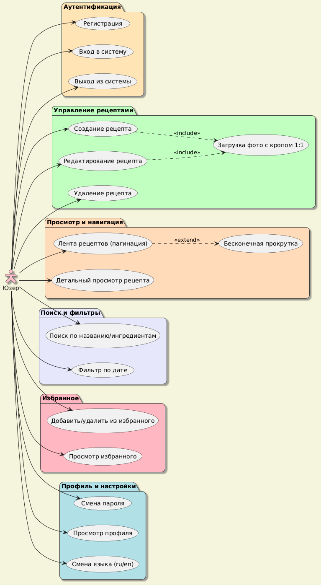
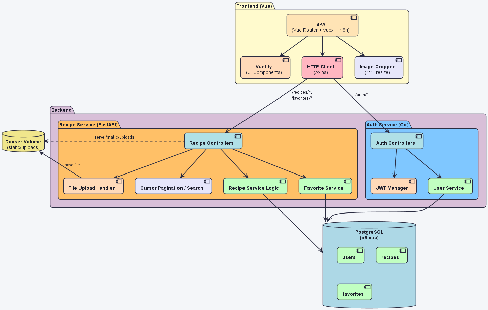
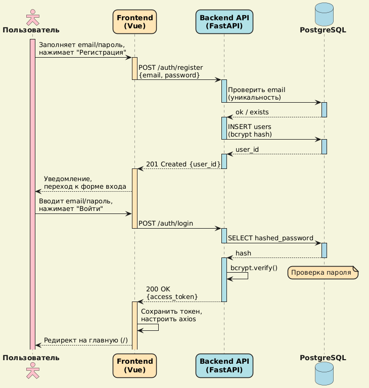
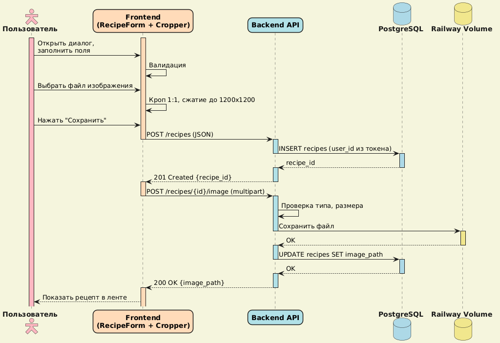
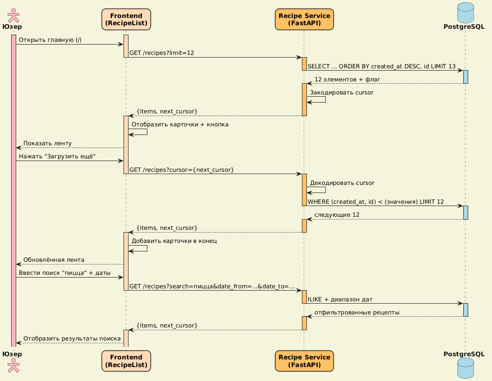
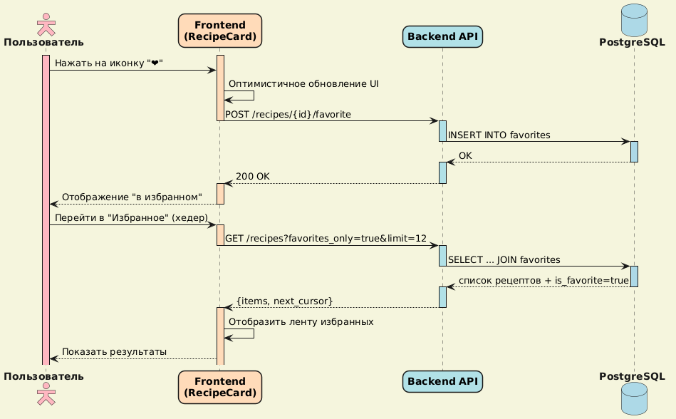

# cook-book: техническое задание

## 1. Общее описание

**Книга рецептов** - веб-приложение, где юзер управляет **только своей** коллекцией рецептов. Реализованы регистрация/вход (JWT), создание/редактирование/удаление рецептов с загрузкой квадратного фото, добавление в избранное, поиск и фильтрация.
Приложение адаптивное с русским и английским интерфейсом.

### 1.1. Особенности

- **Архитектура**: два микросервиса:
  - **Go (auth-сервис)** - аутентификация, управление пользователями, выпуск JWT.
  - **Python (FastAPI) (recipe-сервис)** - управление рецептами, избранное, поиск, пагинация, загрузка фото.
- **Frontend**: Vue 3 + Vuetify, единый для обоих сервисов.
- **Деплой**: локальный через `Dockerfile` и `docker-compose`.
- **База данных**: общая PostgreSQL. Для упрощения разработки и деплоя используется одна БД, но таблицы логически разделены:
  - `users` - только для Go-сервиса (миграции через `golang-migrate`).
  - `recipes`, `favorites` - только для Python-сервиса (миграции через Alembic).
  Такой подход избавляет от необходимости поднимать две БД, при этом сохраняет независимость разработки - каждый сервис работает только со своими таблицами. Для удобства работы через веб-интерфейс в `docker-compose` добавляется **Adminer**.
- **Хранение файлов**: общий Docker-том для изображений, монтируется в Python-сервис (Go-сервис не пишет в него).
- **Документация API**: оба сервиса должны предоставлять качественную Swagger-спецификацию (OpenAPI 3.0), генерируемую автоматически из кода. Это упрощает интеграцию, тестирование и дальнейшую поддержку.

---

## 2. Диаграмма прецедентов

Показывает кейсы, доступные юзеру системы.



---

## 3. Архитектура и модули системы

В основу проекта положена микросервисная архитектура с общей БД и независимыми сервисами.

### 3.1. Диаграмма компонентов

Показывает структуру взаимодействия фронтенда, двух бэкенд-сервисов, базы данных и хранилища файлов.



### 3.2. Фронтенд (Vue 3)

- **SPA-Core**: Маршрутизация (Vue Router), управление состоянием (Vuex 4), интернационализация (Vue i18n).
- **UI-Kit (Vuetify 3)**: Набор готовых компонентов для быстрой и качественной верстки.
- **HTTP-Client (Axios)**: Настроенный клиент с двумя экземплярами - для Auth Service и для Recipe Service. Обрабатывает куки (`withCredentials: true`).
- **Image Cropper**: Модуль на базе `cropperjs` для подготовки фото (1:1, resize).

### 3.3. Бэкенд

#### 3.3.1. Auth Service (Go, Gin)

- **API Controllers**: Эндпоинты для регистрации, входа, выхода, смены пароля, получения профиля.
- **User Service**: Бизнес-логика работы с юзерами (создание, проверка пароля, обновление).
- **JWT Manager**: Генерация и верификация access/refresh токенов. Токены передаются через **httpOnly, Secure, SameSite=Strict cookies**.
- **Работа с БД**: Только таблица `users` (через GORM). Миграции - `golang-migrate`.
- **Swagger/OpenAPI**: Автоматическая генерация спецификации. Использовать `swaggo/swag`. В результате должен быть доступен эндпоинт `/swagger/index.html` с интерактивной документацией.

#### 3.3.2. Recipe Service (Python, FastAPI)

- **API Controllers**: Эндпоинты для CRUD рецептов, загрузки фото, управления избранным, поиска и пагинации.
- **Recipe Service**: Бизнес-логика работы с рецептами (валидация, принадлежность юзеру).
- **Favorite Service**: Модуль управления списком избранного (идемпотентные операции).
- **File Upload Handler**: Валидация (magic bytes, размер, тип) и сохранение изображений в общий том.
- **Cursor Pagination / Search**: Эффективная выборка с курсорами (`created_at, id`) и полнотекстовый поиск (ILIKE / GIN-индексы).
- **JWT Валидация**: Проверяет JWT, полученный от фронта, используя общий с Go-сервисом секретный ключ (без вызова Auth Service). Извлекает `user_id` для фильтрации данных.
- **Swagger/OpenAPI**: FastAPI предоставляет автодокументацию по умолчанию (эндпоинты `/docs` и `/redoc`). Необходимо настроить их для корректного отображения всех моделей, параметров и схем безопасности (включая JWT cookie). Требуется явно описать все эндпоинты с помощью `@app.post(..., response_model=..., tags=...)`, используя Pydantic-модели и `Cookie` параметры для токенов.

### 3.4. Слой данных

- **PostgreSQL**: Общая реляционная БД. Таблицы:
  - `users` - управляется Auth Service (Go).
  - `recipes` и `favorites` - управляются Recipe Service (Python).
- **Миграции**:
  - Для Go-сервиса - `golang-migrate` (папка `auth/migrations`).
  - Для Python-сервиса - Alembic (папка `recipe/migrations`).
- **Веб-интерфейс для БД**: В `docker-compose` добавляется сервис **Adminer** для удобной работы с PostgreSQL через браузер.
- **Docker Volume**: Постоянное хранилище для медиафайлов, монтируется в контейнер Recipe Service.

---

## 4. Функциональные требования (MVP)

### 4.1. Аутентификация и юзеры (Auth Service на Go)

- **Регистрация**: email + пароль.
- **Вход**: Возвращает **Access Token** (30 мин) и **Refresh Token** (7 дней) через **httpOnly cookies**.
- **Безопасность**: Пароли хешируются `bcrypt`. Токены верифицируются обоими сервисами с помощью общего секрета.
- **Изоляция**: Recipe Service получает `user_id` из токена и фильтрует данные только этого юзера.

### 4.2. Управление рецептами (Recipe Service на Python)

- **Создание**: Название (до 200 симв.), ингредиенты (TEXT), шаги (TEXT), время (min), сложность (easy/medium/hard).
- **Фото**: Опционально. Обязательный кроп 1:1 на фронте перед загрузкой. Сохранение в `image_path` (относительный путь). Файлы хранятся в общем томе.
- **Редактирование/Удаление**: С подтверждением действия. Проверка прав: изменять/удалять может только владелец рецепта.

### 4.3. Избранное (Recipe Service)

- Идемпотентные эндпоинты для добавления/удаления.
- Отдельный раздел "Избранное" в интерфейсе.
- Мгновенное обновление UI при переключении.

### 4.4. Поиск и пагинация (Recipe Service)

- **Поиск**: по названию и ингредиентам одновременно (ILIKE).
- **Фильтры**: по дате публикации (от/до).
- **Cursor-based Pagination**: Использование base64-курсора (`created_at, id`) для предотвращения дубликатов при динамической подгрузке.

---

## 5. Сценарии работы (Sequence Diagrams)

### 5.1. Регистрация и вход



### 5.2. Создание рецепта с фото



### 5.3. Пагинация и поиск



### 5.4. Избранное



---

## 6. Нефункциональные требования

### 6.1. Безопасность

- **Пароли**: `bcrypt` для хеширования (Auth Service).
- **JWT**: **httpOnly cookies** для предотвращения кражи токенов через JS. Оба сервиса используют один секретный ключ для валидации.
- **Валидация**: строгая проверка типов данных через Pydantic (Python) и стандартные средства Go (struct tags).
- **CORS**: Настроены правила для разрешения запросов с фронта к разным портам (Auth Service и Recipe Service).

### 6.2. Производительность

- **Оптимизация изображений**: сжатие на клиенте до 1200x1200px перед отправкой.
- **Индексы БД**: `recipes(user_id, created_at DESC, id)`, `recipes(user_id, title)`.
- **Stateless сервисы**: оба сервиса не хранят состояние сессий, что упрощает масштабирование.

### 6.3. Удобство (UX/UI)

- **Адаптивность**: корректное отображение на мобильных устройствах (от 320px).
- **Обратная связь**: использование Skeleton loaders при загрузке и Snackbar для уведомлений об ошибках/успехе.
- **i18n**: поддержка двух языков (RU/EN) для всех элементов интерфейса.

### 6.4. Надежность

- **Persistence**: использование Docker Volume для хранения загруженных фото.
- **Graceful degradation**: показ плейсхолдера, если фото рецепта не загрузилось.
- **Изоляция отказов**: падение одного сервиса не останавливает другой (автономные endpoints).

### 6.5. Документация API (Swagger/OpenAPI)

- **Auth Service (Go)**:
  - Использовать `swaggo/swag`.
  - Аннотировать все эндпоинты, модели запросов/ответов.
  - Сгенерированная спецификация должна быть доступна по маршруту `/swagger/index.html`.
  - В спецификации должны быть описаны схемы безопасности (JWT, получаемый из cookie).
- **Recipe Service (Python)**:
  - FastAPI автоматически генерирует OpenAPI. Необходимо:
    - Для каждого эндпоинта указать `response_model`, `tags`, `summary`, `description`.
    - Использовать Pydantic-модели для валидации и сериализации.
    - Добавить глобальную схему безопасности `apiKey` (in: cookie) с именем `access_token`.
    - Убедиться, что все параметры (query, path, body, file) корректно отображаются в `/docs` и `/redoc`.
- **Общие требования**:
  - Спецификации должны соответствовать OpenAPI 3.0.
  - Документация должна позволять фронтенд-разработчику полностью понять все эндпоинты, форматы данных и способы аутентификации без обращения к исходному коду.
  - При локальном запуске через `docker-compose` документация каждого сервиса должна быть доступна по соответствующим портам:
    - Auth Service: `http://localhost:8000/swagger/`
    - Recipe Service: `http://localhost:8080/docs`

---

## 7. Подводные камни и решения

| Проблема                                  | Решение                                                                                                                                    |
| ----------------------------------------- | ------------------------------------------------------------------------------------------------------------------------------------------ |
| **Синхронизация JWT между сервисами**     | Оба сервиса используют один секретный ключ (переменная окружения `JWT_SECRET`). Токены верифицируются независимо.                          |
| **Дубликаты в избранном**                 | Уникальный Constraint `(user_id, recipe_id)` в таблице `favorites`.                                                                        |
| **Сложность i18n для перечислений**       | Хранение в БД английских ключей (`easy`, `medium`, `hard`), маппинг на фронте через `$t('difficulty.' + key)`.                             |
| **Обрыв загрузки фото**                   | Транзакционное создание рецепта: сначала запись в БД, затем загрузка файла. Если файл не загружен, рецепт остается без фото (плейсхолдер). |
| **Размер JWT**                            | Не хранить лишние данные в payload токена, только `user_id` и `exp`.                                                                       |
| **Конкуренция за общий volume**           | Recipe Service один работает с томом; Auth Service не пишет в него.                                                                        |
| **Миграции двух сервисов**                | В `docker-compose` запускаются два init-контейнера: `migrate-auth` (golang-migrate) и `migrate-recipe` (Alembic) перед стартом сервисов.   |
| **Удобство работы с БД**                  | В `docker-compose` добавлен **Adminer** (порт 8081) для веб-интерфейса к PostgreSQL.                                                       |
| **Документирование JWT cookie в OpenAPI** | Для FastAPI использовать `Cookie` параметр в функции эндпоинта и включить его в схему. Для Go - аннотации с пометкой `in: cookie`.         |

---

## 8. Модель базы данных (PostgreSQL)

### Таблица `users` (управляется Auth Service на Go)

- `id`: UUID (PK)
- `email`: VARCHAR(255) UNIQUE
- `hashed_password`: VARCHAR(255)
- `created_at`: TIMESTAMPTZ

### Таблица `recipes` (управляется Recipe Service на Python)

- `id`: UUID (PK)
- `user_id`: UUID (FK -> users.id)
- `title`: VARCHAR(200)
- `ingredients`: TEXT
- `steps`: TEXT
- `cooking_time`: INTEGER
- `difficulty`: VARCHAR(20) (easy, medium, hard)
- `image_path`: VARCHAR(500) (NULL)
- `created_at`: TIMESTAMPTZ
- `updated_at`: TIMESTAMPTZ

### Таблица `favorites` (управляется Recipe Service на Python)

- `user_id`: UUID (FK -> users.id)
- `recipe_id`: UUID (FK -> recipes.id)
- `created_at`: TIMESTAMPTZ
- *Constraint*: UNIQUE(user_id, recipe_id)

---

## 9. План реализации (5-7 дней)

1. **День 1**: Настройка инфраструктуры - `docker-compose`, PostgreSQL, общий volume. Добавление Adminer. Разработка Auth Service на Go: регистрация, логин, JWT в cookies. Настройка генерации Swagger для Go.
2. **День 2**: Recipe Service на Python (FastAPI): каркас, валидация JWT, эндпоинт GET `/recipes` с пагинацией. Настройка автодокументации FastAPI (`/docs`).
3. **День 3**: CRUD рецептов на Python, интеграция с БД, загрузка фото (сохранение на volume). Обновление Swagger-спецификации.
4. **День 4**: Избранное на Python (эндпоинты POST/DELETE, просмотр избранных рецептов). Документирование этих эндпоинтов.
5. **День 5**: Поиск и фильтры на Python, индексы БД. Проверка корректности OpenAPI.
6. **День 6**: Фронтенд (Vue 3): подключение к двум сервисам, формы, i18n, адаптив. Фронтенд может использовать сгенерированные OpenAPI-клиенты (например, `openapi-generator`) для упрощения работы.
7. **День 7**: Интеграционное тестирование, отладка `docker-compose`, проверка доступности Swagger для обоих сервисов, документация.

---

## 10. Деплой (локальный, Docker Compose)

Используется `docker-compose.yml` для запуска пяти контейнеров:

- **postgres**: БД с именованным томом для данных.
- **adminer**: Веб-интерфейс для PostgreSQL (порт 8081).
- **auth_service**: Go-сервис (бинарник), порт 8000.
- **recipe_service**: Python (FastAPI) + Uvicorn, порт 8080.
- **frontend**: Nginx, раздающий собранную статику Vue 3. Порты 80 -> 80.

**Общий volume** `uploads_volume` монтируется в `/app/static/uploads` контейнера `recipe_service`.

**Миграции**: два сервиса миграций (`migrate-auth`, `migrate-recipe`), которые выполняются до запуска основных сервисов (используется `depends_on` с условием или скрипт entrypoint). Для Python-миграций используется `alembic upgrade head`, для Go - `migrate -path ./migrations -database "$DATABASE_URL" up`.

**Swagger доступен**:

- Auth Service: `http://localhost:8000/swagger/index.html`
- Recipe Service: `http://localhost:8080/docs` и `http://localhost:8080/redoc`

**Переменные окружения** задаются в `.env` файле:

- `DATABASE_URL` (общая для обоих сервисов)
- `JWT_SECRET` (общий секрет)
- `UPLOAD_DIR=/app/static/uploads`
- `AUTH_SERVICE_PORT=8000`
- `RECIPE_SERVICE_PORT=8080`
- `ADMINER_PORT=8081`

**Пример структуры**:

```
cook-book/
├── auth/
│   ├── Dockerfile
│   ├── cmd/
│   ├── internal/
│   ├── migrations/
│   └── docs/ (сгенерированная swagger)
├── recipe/
│   ├── Dockerfile
│   ├── app/
│   └── migrations/
├── frontend/
│   ├── Dockerfile
│   └── dist/ (сборка)
├── .env
├── docker-compose.yml
└── volumes/
    └── uploads/
```

**Запуск**: `docker-compose up --build`
